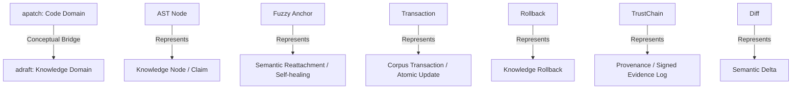

# Request for Proposal (RFP-001): adraft (apatch-docs) 🧬🗺️
## Mutable Transactional Knowledge Graph with Semantic Identity

---

## 1. Введение и концепция (Executive Summary)

Современные системы RAG (Retrieval-Augmented Generation) и многоагентные системы написания документов страдают от фундаментального архитектурного порока: **они работают со знаниями как со статичным, плоским «супом из токенов» (flat token soup)**. Примитивное деление документов на позиционные чанки (chunking) приводит к потере структурной, логической и причинно-следственной связности. Любое изменение документа вызывает лавинообразный сдвиг границ чанков, инвалидацию баз данных векторов и разрушение системы цитирования.

**Проект `adraft` (apatch-docs)** — это революционная концепция **перехода от stateless позиционных чанков к самозаживляющимся семантическим объектам знаний (Transactional Knowledge Objects)** с постоянной идентичностью.

retrieval становится не задачей типа **“найди похожий текст по косинусному расстоянию”**, а задачей вида **“найди релевантные semantic entities и их graph neighborhood”**.

Благодаря интеграции `adraft` непосредственно в `apatch`, инструмент переходит на новый качественный уровень позиционирования:
```text
До:  apatch = recovery tool для кодовых сессий агентов
После: apatch = transactional execution layer для любых агентных операций
               (код, документы, знания)
```
Используя накопленный в `apatch` опыт борьбы с дрейфом контекста исходного кода, `adraft` переносит идеи синтаксических AST-деревьев, непозиционных якорей, транзакционных откатов и криптографического аудита TrustChain на домен слабоструктурированной текстовой информации (Markdown, LaTeX, HTML).

---

## 2. Проблема vs Решение: Смена парадигмы

| Аспект | Классический RAG (Stateless & Flat) | adraft Runtime (Transactional & Topological) |
| :--- | :--- | :--- |
| **Единица хранения** | Случайный плоский текстовый фрагмент (chunk) | Семантический объект знаковых связей (`claim`, `method`, `equation`, `definition`, `result`) |
| **Идентификация** | Позиционная (сдвигается и ломается при любом редактировании) | Стабильный непозиционный семантический якорь (**Semantic ID, или `sid`**) |
| **Способ Retrieval** | Косинусное сходство векторов (ближайшие соседи в плоском пространстве) | Многоуровневый обход семантического подграфа (**Subgraph Retrieval + Lineage**) |
| **Правки и обновления** | Полное перестроение базы векторов или инвалидация / дублирование | Точечные инкрементальные транзакционные апдейты конкретных `sid` |
| **Целостность данных** | Подвержен противоречиям, потере контекста и "галлюцинациям объединения" (hallucinated joins) | Автоматический контроль непротиворечивости, валидация связей и откат транзакций |
| **Аудит изменений** | Отсутствует / обычный Git diff на уровне символов | Криптографически подписанная хроника изменений (`TrustChain`) с Blame-анализом на уровне утверждений |

---

## 3. "AST для знаний" (AST for Knowledge)

Как абстрактное синтаксическое дерево (AST) превосходит простые строки при анализе и трансформации исходного кода, так и **семантический граф (Semantic Graph)** превосходит примитивные текстовые чанки при работе со знаниями.

```text
Обычный RAG:
[ Document ] ──> [ Split into Chunks ] ──> [ Embeddings ] ──> [ Nearest Neighbors ] ──> [ Shove into Prompt ]
                                                                                           (Flat Token Soup)

Semantic-anchor RAG (adraft):
[ Knowledge Object ] ──> [ Topological Parsing ] ──> [ Graph Neighborhood Retrieval ] ──> [ Reasoning Substrate ]
```

При разбиении на обычные чанки (chunking) безвозвратно теряются:
*   **Происхождение (provenance) и источник** конкретных утверждений.
*   **Логические и иерархические связи** между частью документа.
*   **Эволюция и хронология** документа во времени.
*   **Зависимость выводов** (какое допущение легло в основу какого вывода).
*   **Семантическая локальность (semantic locality)**.

`adraft` решает эту проблему за счет превращения плоского текста в строго типизированную сеть знаний, где каждый узел знает свои зависимости, историю и контекст.

---

## 4. Концептуальный мост: Перенос философии `apatch`

Уникальность `adraft` заключается в том, что проверенные временем концепции транзакционного патчинга кода из `apatch` естественным образом переносятся на управление знаниями:

| Концепт `apatch` (Code Domain) | Концепт `adraft` (Semantic RAG Domain) | Описание |
| :--- | :--- | :--- |
| **AST Node** | **Knowledge Node (Claim / Object)** | Единица смысла со строгим типом и стабильным идентификатором |
| **Fuzzy Anchor** | **Semantic Reattachment / Self-healing** | Восстановление связей узла при изменении или перемещении текста |
| **Transaction** | **Corpus Update / Atomic Transaction** | Атомарное обновление группы связанных утверждений |
| **Rollback** | **Knowledge Rollback** | Безопасный откат базы знаний к предыдущему логическому срезу |
| **TrustChain** | **Provenance Ledger** | Криптографически подписанный реестр происхождения фактов |
| **Patch** | **Claim Transformation** | Логическое изменение, перефразирование или перевод утверждения |
| **Diff** | **Semantic Delta** | Разница между двумя состояниями графа знаний на логическом уровне |



---

## 5. Механика "Drift-Resistant Corpora" (Борьба с дрейфом)

Современные корпоративные RAG-системы катастрофически страдают от обновлений документов. Появление новой версии регламента, спецификации или научной статьи приводит к:
1.  **Дублированию эмбеддингов** (векторная база содержит и старые, и новые куски, LLM путается в версиях).
2.  **Stale Chunks** (устаревшие данные продолжают всплывать в результатах поиска).
3.  **Сломанным ссылкам** (цитаты агентов начинают указывать на несуществующие параграфы).

Если у каждого логического объекта есть стабильный семантический идентификатор (**`sid`**, например, `claim_182`), то жизненный цикл документа становится контролируемым:
*   **Точечный апдейт векторов:** При обновлении текста утверждения `claim_182` пересчитывается и перезаписывается эмбеддинг *только для этого конкретного узла*. Векторная база данных не пересобирается целиком.
*   **Сохранение топологии:** Ссылки (`references`), направленные на `claim_182` из других документов, остаются валидными, даже если само утверждение было перефразировано или перемещено в другой раздел документа.
*   **Lineage & Versioning:** Каждая нода хранит историю своих изменений, позволяя LLM видеть эволюцию конкретной идеи во времени.

---

## 6. Кардинальное снижение галлюцинаций (Reasoning Substrate)

В классическом RAG модель LLM получает на вход "плоский кусок текста", похожий на поисковый запрос по эмбеддингу. Модель вынуждена на лету додумывать связи между абзацами, что приводит к **галлюцинациям объединения (hallucinated joins)** и логическим противоречиям.

В архитектуре `adraft` контекст превращается в **Reasoning Substrate** (субстрат для рассуждений). Вместо плоского текста LLM видит структурированную логическую схему:

```text
Claim A (id: claim_182)
  ├── Text: "Hyperbolic attention scales sublinearly for long sequences."
  ├── Supported by: 
  │     ├── Source: paper_12 (arXiv:2603.XXXX)
  │     └── Experiment: exp_91 (accuracy delta: +4.2%)
  └── Contradicted by:
        └── Claim: claim_77 ("Hyperbolic attention degenerates on highly structured hierarchical graphs")
```

LLM больше не занимается интерполяцией случайных кусков текста. Она оперирует явными декларативными связями: видит гипотезы, доказательства, опровержения и источники, что сводит риск фактологических галлюцинаций к минимуму.

---

## 7. Трехуровневый контур поиска (3-Tier Retrieval Pipeline)

Благодаря стабильной семантической структуре и ориентированному графу связей, процесс извлечения (retrieval) становится интеллектуальным и многоуровневым:

```text
                                  [ User Query ]
                                        │
  ┌─────────────────────────────────────┴─────────────────────────────────────┐
  │ Level 1: Embedding Recall                                                 │
  │ Нахождение первичных recall-кандидатов (концепты, термины, ключевые ноды) │
  └─────────────────────────────────────┬─────────────────────────────────────┘
                                        │ (semantic anchors)
                                        ▼
  ┌───────────────────────────────────────────────────────────────────────────┐
  │ Level 2: Graph Expansion                                                  │
  │ Обход графа по связям: подтягивание lineage, parents, dependencies,        │
  │ evidence (доказательств) и rebuttals (опровержений) для полноты контекста │
  └─────────────────────────────────────┬─────────────────────────────────────┘
                                        │ (subgraph neighborhood)
                                        ▼
  ┌───────────────────────────────────────────────────────────────────────────┐
  │ Level 3: Consistency Pruning                                              │
  │ Анализ и фильтрация: удаление устаревших (obsolete), опровергнутых и      │
  │ низкодостоверных (low-confidence) узлов для кристальной чистоты контекста │
  └─────────────────────────────────────┬─────────────────────────────────────┘
                                        │
                                        ▼
                            [ Pristine Context Graph ]
```

---

## 8. Влияние на Long-Context Systems

Появление моделей с контекстным окном в миллионы токенов породило иллюзию, что RAG больше не нужен. Однако это глубокое заблуждение:
*   Миллион токенов без структуры — это всё ещё **плоский суп из токенов (flat token soup)**.
*   Модели по-прежнему страдают от феномена "lost in the middle" (потеря информации в середине контекста).
*   У агентов отсутствует механизм referential stability — они не могут сослаться на конкретную мысль так, чтобы другие агенты поняли точные границы этой мысли.

`adraft` предоставляет long-context системам **топологию, иерархию, локальность и ссылочную стабильность**. Это позволяет агентам работать с гигантскими объемами информации не как с бесконечной лентой текста, а как с четко структурированной трехмерной картой знаний.

---

## 9. Сравнение JSON-схем хранения данных

### Legacy RAG (Плоский чанк)
```json
{
  "id": "uuid-8f92-41ba",
  "text": "Hyperbolic attention is highly effective for processing hierarchical structures. Under testing, it achieved sublinear scaling...",
  "document_source": "paper_12.pdf",
  "chunk_index": 14,
  "embedding": [0.12, -0.45, 0.89, "..."]
}
```
*Проблема:* Сдвиг одного предложения в начале `paper_12.pdf` изменит границы этого чанка, его хэш, его вектор и разрушит связь с соседними чанками.

### `adraft` Transactional Knowledge Object
```json
{
  "id": "claim_182",
  "type": "claim",
  "text": "Hyperbolic attention scales sublinearly for long sequences.",
  "parents": ["section_related_work", "concept_hyperbolic_geometry"],
  "supports": ["exp_91"],
  "contradicts": ["claim_77"],
  "sources": ["paper_12"],
  "lineage": {
    "created_at": "2026-05-28T10:00:00Z",
    "last_modified_by": "agent_alpha",
    "version": 4,
    "parent_version_hash": "sha256-abc123xyz"
  },
  "embedding": [0.15, -0.42, 0.91, "..."]
}
```
*Преимущество:* Текст может быть переписан или перемещен, но `claim_182` сохраняет свою семантическую идентичность, историю правок и связи.

---

## 10. Спецификация модулей системы в рамках `apatch`

```text
apatch сейчас:
  ingestor.py   → парсит логи агентов
  matcher.py    → 3 уровня: exact → fuzzy → AST (для кода)
  strip.py      → вырезает блоки
  backup.py     → транзакции
  trustchain    → аудит

apatch + adraft модуль:
  + semantic_parser.py  → то же что matcher.py, но для текста
  + knowledge_graph.py  → sid, lineage, связи
  + vector_sync.py      → инкрементальный upsert в Chroma/Qdrant
```

### 🪐 Модуль 1: Семантический парсер разметки (Semantic CST Parser)
Модуль транслирует плоский текст (Markdown/LaTeX) в **Конкретное семантическое дерево (Concrete Semantic Tree, CST)**.
*   **Идентификация объектов:** Вычленяет логические единицы (`claim`, `equation`, `definition`, `methods`, `results`, `assumption`).
*   **Внедрение якорей:** При первом проходе автоматически инжектирует скрытые HTML-комментарии (например, `<!-- @sid:claim_182 -->`) непосредственно перед каждым логическим узлом в файле разметки.
*   **Связи и импорты:** Парсит перекрестные ссылки, цитирования источников и строит ориентированный граф зависимостей внутри документа.

### 🧠 Модуль 2: Движок самозаживления (Probabilistic Neighborhood Re-anchoring)
Если тег якоря `sid` стёрт пользователем или ИИ-агентом в ходе неаккуратного редактирования, движок восстанавливает его положение с помощью каскада нечеткого поиска:
*   **Level 1 (Exact):** Буквальное совпадение текста объекта.
*   **Level 2 (Neighborhood-Fuzzy / AST):** Вычисление хэша окрестности (ближайшие соседние утверждения, иерархия заголовков `lineage`, схожесть структуры документа).
*   **Level 3 (Semantic vector match):** Сравнение косинусного сходства эмбеддинга осиротевшего текста с базой знаний. При совпадении $> 0.9$ узел признаётся идентичным, и якорь `sid` автоматически перезаписывается на диск.

### ⚡ Модуль 3: Транзакционный менеджер обновлений (Speculative Knowledge Sandbox)
Обеспечивает строгость ACID для операций над базой знаний:
*   **Пакетные апдейты:** Изменение нескольких утверждений в рамках одного шага лога ИИ-агента происходит атомарно.
*   **Авто-верификация:** После применения апдейта запускается валидатор графа (проверка на отсутствие логических петель, висячих ссылок и прямых логических противоречий).
*   **Инкрементальный Upsert:** Обновлённый `sid` точечно отправляется в Vector DB (например, Qdrant/Chroma), не затрагивая остальные эмбеддинги.

### 🛡️ Модуль 4: Леджер происхождений (TrustChain Provenance Ledger)
Интегрирует криптографический аудит в жизненный цикл знаний:
*   При каждом изменении узла `claim_182` генерируется крипто-чекпоинт в локальном хэш-чейн реестре (TrustChain ledger).
*   Транзакция подписывается приватным ключом автора/агента с фиксацией SHA-256 хэша семантического дельта-пакета.
*   Реализуется инструмент `Blame`: возможность мгновенно проследить происхождение, авторство и изменения конкретной формулировки, юридической оговорки или научной константы.

---

## 11. Грандиозное видение: Семантическая операционная система (Semantic OS)

Большинство современных RAG-систем представляют собой простые пассивные хранилища (append-only, stateless). Внедрение парадигмы `adraft` переводит нас в плоскость **Mutable Transactional Knowledge Graph with Semantic Identity**.

Это фундамент для создания полноценных **символьно-нейронных гибридных систем (symbolic-neural hybrids)** и **динамической памяти агентов (dynamic memory / persistent cognition)**. База знаний превращается в семантическую операционную систему, где:
*   Знания могут активно мутировать под воздействием новых фактов.
*   Конфликты знаний разрешаются транзакционно через консенсус агентов.
*   Возможен мгновенный откат (rollback) ложных теорий или устаревших данных без разрушения остальной структуры.

---

## 12. Поэтапный план реализации (Roadmap)

Внедрение концепций `adraft` планируется выполнять итеративно, непосредственно в рамках единой кодовой базы `apatch`. Это позволит сохранить единую философию, архитектуру транзакций и криптографический аудит TrustChain.

### 🏁 Шаг 1: Разработка MCP-обертки для `apatch` (Distribution & Traction)
*   **Цель:** Обеспечить быструю дистрибуцию, удобство интеграции в агентские среды (Claude Code, Cline, Windsurf и др.) и получение первичного фидбека от сообщества.
*   **Результат:** Готовый MCP-сервер, предоставляющий интерфейс к транзакционному патчингу кода и сессиям.

### 🧠 Шаг 2: Создание Markdown Matcher (малая дельта к существующему коду)
*   **Цель:** Расширить логику `matcher.py` поддержкой нового типа документов (Markdown/LaTeX).
*   **Результат:** Поддержка нечеткого (fuzzy) текстового сопоставления абзацев вместо структурного AST-парсинга кода. Трёхуровневый матчер `apatch` начинает работать со слабоструктурированным текстом так же надежно, как с кодом.

### ⚡ Шаг 3: Реализация команды `compile` и инжекции `sid` (MVP adraft)
*   **Цель:** Добавить команду `apatch compile doc.md` для полноценной разметки документов.
*   **Результат:** 
    *   Автоматическая инжекция скрытых тегов `<!-- @sid:claim_182 -->` перед логическими блоками документа.
    *   Генерация индексного файла карты знаний `knowledge_map.json` (список блоков, их хэши, иерархия lineage).
    *   Обеспечение стабильности идентификаторов `sid` при редактировании (Level 2/3 матчера предотвращает поломку связей при перефразировании или перемещении абзацев).

### 🛡️ Шаг 4: Выделение в отдельный репозиторий `adraft` (По требованию сообщества)
*   **Цель:** Оформить `adraft` как независимый продукт для Enterprise-решений и распределенных баз данных векторов.
*   **Результат:** Отдельный репозиторий и пакет, если возникнет явный спрос со стороны сообщества. В противном случае `adraft` развивается как органичный модуль внутри `apatch`.

---

## 13. Согласованные архитектурные решения (Resolved Decisions)

> [!IMPORTANT]
> На основе анализа фидбека и выработки единой стратегии, концептуальные развилки зафиксированы в следующих решениях:
> 
> 1. **Формат хранения метаданных [RESOLVED]:** Чистые стабильные ID (`<!-- @sid:id -->`) внедряются непосредственно в текст в виде HTML-комментариев для сохранения полной переносимости. Сложные метаданные (lineage, citations, хэши окрестности) генерируются компилятором в файл `knowledge_map.json`, что избавляет исходный документ от замусоривания.
> 2. **Приоритетный стек технологий [RESOLVED]:** MVP разрабатывается на **Python** как органичный модуль расширения в составе репозитория `apatch` (`apatch/semantic_parser.py`, `apatch/knowledge_graph.py`). Это позволяет повторно использовать отлаженные механизмы транзакционности, откатов и TrustChain.
> 3. **Интеграция с Vector DB [RESOLVED]:** На первом этапе реализуется точечный инкрементальный upsert во встроенную легковесную векторную БД для обеспечения нулевых зависимостей при локальном использовании, с последующим абстрагированием под Qdrant/Chroma.
