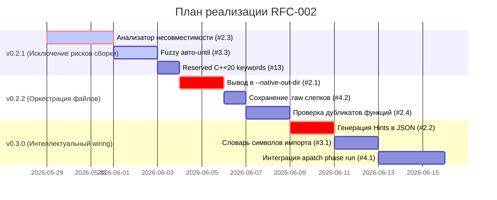

# RFP-002: Сквозной пайплайн декомпозиции и компиляции C++ Native модулей ✂️🚀

* **Статус**: Draft (Обсуждение)
* **Автор**: Ed Cherednik, Antigravity AI
* **Дата**: 2026-05-28
* **Целевая версия**: `apatch` v0.2.x - v0.3.0

---

## 1. Контекст и мотивация

В ходе рефакторинга монолитного интерпретатора `eval_visitor` (фазы 9–11) утилита `apatch strip` и C++ конвертер `convert_extracted_to_native.py` зарекомендовали себя как надежный промышленный пайплайн. Однако процесс рефакторинга все еще остается двухшаговым и требует ручного вмешательства:
1. Вырезанные raw-блоки остаются in-place в `extracted/`, требуя внешнего копирования (`cp`) в рабочие папки компиляции.
2. Ручная привязка (wiring) в `CMakeLists.txt`, `olang_parser.hpp` и `native_registration.cpp` отнимает время ИИ-агентов и разработчиков.
3. Ошибки несовместимости AST-контекста C++ (вызовы `eval()`, `temporal` и т.д.) обнаруживаются слишком поздно — на этапе сборки CMake, а не в момент работы strip.

Настоящий RFC (Request for Comments) описывает расширение функционала `apatch` для превращения декомпозиции кода в полностью бесшовный пайплайн «в один клик».

---

## 2. P0 — Высокий приоритет (Must Have)

### 2.1. [РЕАЛИЗОВАНО в v0.2.2] Прямой вывод Native-модулей (`--native-out-dir`)
**Проблема**: Конвертер перезаписывает сырой `extracted/native_eval_FOO.cpp`, а последующее копирование в `interpreter/` ложится на плечи внешнего `--post-hook` shell-скрипта.
**Решение**: Встроить параметр вывода нативных модулей прямо в CLI:
```bash
apatch strip --to-native register_stl_builtins --native-out-dir src/frontend/interpreter
```
* **Поведение**: 
  * В `--out-dir` сохраняется исходный сырой слепок `.raw.cpp` и файл связей `extraction_report.json`.
  * Сконвертированный рабочий модуль C++ записывается сразу в директорию `--native-out-dir`.
  * Устраняется риск забыть сделать `cp` или ошибиться в путях.

### 2.2. [РЕАЛИЗОВАНО в v0.3.0] Машиночитаемый чеклист привязки (Wiring Hints)
**Проблема**: Интеграция вырезанного модуля требует от агента ручного анализа сигнатур и редактирования CMake файлов.
**Решение**: Добавить в `extraction_report.json` структурированные подсказки для ИИ-агентов:
```json
"wiring_hints": {
  "register_func": "register_stl_builtins",
  "header_decl": "void register_stl_builtins();",
  "registration_call": "register_stl_builtins();",
  "cmake_snippet": "src/frontend/interpreter/native_eval_stl.cpp",
  "cmake_embedded_snippet": "${OLANG_CPP_DIR}/src/frontend/interpreter/native_eval_stl.cpp"
}
```
Также добавить флаг для экспорта удобного Markdown-патча для человека:
```bash
apatch strip ... --emit-wiring patches/wiring_phase12.md
```

### 2.3. [РЕАЛИЗОВАНО в v0.2.1] Статический анализатор несовместимости («нельзя в native без доработки»)
**Проблема**: Некоторые C++ конструкции внутри монолита не могут быть перенесены в изолированный native-модуль без полной перестройки сигнатур или контекста (например, отложенные вычисления или прямые JIT-манипуляции).
**Решение**: Конвертер при анализе сырого блока сканирует код на запрещенные паттерны:

| Паттерн | Тип | Действие / Предупреждение |
| :--- | :--- | :--- |
| `eval(call->args` | `WARN` | `needs_eval_arg` (может сломать temporal/lazy семантику) |
| `temporal_from_value` / `get_hist_value` | `BLOCKER` | `needs_evaluator_context` (требует контекст вычислений) |
| `dynamic_pointer_cast<Identifier>` | `BLOCKER` | `needs_ast_in_value` (требует прямой AST доступ) |
| `measure_time` | `BLOCKER` | `deferred_eval` (зависит от таймингов интерпретатора) |

При обнаружении блокирующих паттернов в `extraction_report.json` пишется отчет:
```json
"conversion_warnings": [
  {"callee": "amplitude", "kind": "needs_evaluator_context", "line": 42}
]
```
Флаг `--strict` принудительно прерывает выполнение с кодом `1` и выполняет **откат checkpoint** (файлы из `.apatch/backups/<session>/` + TrustChain `HEAD`).

**Модель checkpoint в apatch:** одно имя сессии = физический backup + `refs/checkpoints/<name>.ref` + ledger-запись `action: checkpoint` с SHA-256 файлов. `rollback_checkpoint` откатывает всё сразу.

### 2.4. [РЕАЛИЗОВАНО в v0.2.2] Обнаружение дублирующихся `register_native`
**Проблема**: Если одинаковые имена встроенных функций (например, `amplitude`) ошибочно зарегистрированы в двух разных модулях, сборка пройдет успешно, но поведение интерпретатора будет недетерминированным (победит последний вызванный метод).
**Решение**: Добавить команду `apatch natives-check` (или встроить ее в `--to-native`), которая сканирует все `native_eval_*.cpp` файлы в папке и выводит предупреждения о дублировании:
```
WARN: duplicate native 'amplitude' in native_eval_omega_state.cpp and native_eval_stl.cpp
```

---

## 3. P1 — Средний приоритет (Повышение автономности)

### 3.1. [РЕАЛИЗОВАНО в v0.3.0] Умное разрешение импортов по таблице символов
**Проблема**: Простой stem-matching файлов вычищает нужные локальные инклуды, если их имя не совпадает буквально со словом в теле функции (например, символ `OLangTopologyFactory` требует инклуд `#include "olang_stl_topology.hpp"`).
**Решение**: Встроить словарь сопоставления известных сложных символов к их реальным файлам инклудов:
- `OLangTopologyFactory` → `#include "olang_stl_topology.hpp"`
- `OLangHyperphasorFactory` → `#include "olang_stl_hyperphasor.hpp"`
- `omega_jit::` → `#include "backend/jit/jit_bytecode.hpp"`
- `telemetry::` → `#include "olang_telemetry.hpp"`

В отчете фиксируется метод разрешения:
```json
"resolved_includes": ["#include \"olang_stl_topology.hpp\""],
"include_resolution": "symbol_table+stem+fallback"
```

### 3.2. Нормализация accessed_external_members
**Проблема**: Шум при анализе внешних полей (типа `downstream.std` или `items.size`) мешает автогенерации списка `friend`-деклараций.
**Решение**: 
* Приводить внешние обращения к единому стандарту `interp_.foo_` → `foo_`.
* Использовать белый список разрешенных полей (`agent_rec->items` → `Record field access`).
* Формировать отдельный блок `"interpreter_private_fields": ["agent_counter_", "profile_marks_"]`.

### 3.3. [РЕАЛИЗОВАНО в v0.2.1] fuzzy matching и автоопределение until в манифесте
**Проблема**: Синтаксические границы блоков ветвления (`} else if`) часто ломаются из-за комментариев на стыках.
**Решение**: Добавить режим `--suggest-until`. При запуске с флагом утилита предлагает 3 наиболее подходящих кандидата окончания блока.
Добавить опцию `"until_exclusive": "next_else_if"` в JSON-спецификацию манифеста, чтобы границы вычислялись динамически по структуре AST, а не по жестким строкам.

### 3.4. [РЕАЛИЗОВАНО в v0.3.0] Поддержка мультиблоковых имен регистрации
**Проблема**: При вызове `--to-native register_stl_builtins` имя функции жестко задается одно на весь манифест.
**Решение**: Разрешить указывать индивидуальные имена функций регистрации прямо внутри каждого блока манифеста:
```json
{
  "export": "native_eval_m7.cpp",
  "register": "register_m7_builtins"
}
```
CLI опция `--to-native auto` будет считывать это поле для каждой записи индивидуально.

### 3.5. Скорость: Кэширование парсинга
* Внедрить mtime-кэширование исходных файлов. При отсутствии изменений повторный `--dry-run` или проверка манифеста должны занимать <5 секунд за счет пропуска повторного прохода регулярных выражений и CST-парсинга.

---

## 4. P2 — Удобство DX (Качество жизни разработчика)

### 4.1. [РЕАЛИЗОВАНО в v0.3.0] Обёртка фазы рефакторинга (`apatch phase run`)
Объединить весь пайплайн в одну высокоуровневую команду, полностью заменяющую внешние bash-скрипты:
```bash
apatch phase run \
  --manifest manifests/eval_visitor_strips_phase12.json \
  --file src/frontend/interpreter/eval_visitor.cpp \
  --native-out-dir src/frontend/interpreter \
  --out-dir extracted \
  --strict \
  --verify "cmake --build build --target olang_interpreter_core"
```

Перед strip: физический backup исходника + TrustChain checkpoint. При ошибке маркера, `--strict` или падении `--verify` — автоматический откат (`apatch rollback --target-dir .`).

### 4.2. [РЕАЛИЗОВАНО в v0.2.2] Раздельное хранение raw и native слепков
* В папке `--out-dir` (например, `extracted/`) всегда сохранять неизменяемый `.raw.cpp` (исходный «грязный» слепок кода для истории изменений и TrustChain коммитов).
* В папке `--native-out-dir` (например, `interpreter/`) сохранять очищенный и полностью готовый C++ код.

### 4.3. Обогащение полезной нагрузки TrustChain
Записывать в метаданные коммита TrustChain список callees и имя функции регистрации:
```json
"callees": ["create_wta", "wta_set"],
"register_func": "register_stl_builtins"
```

---

## 5. Дорожная карта реализации



---

## 6. Вне рамок данного RFC (Out of Scope)
* Полная автоматическая модификация и перезапись `CMakeLists.txt` (очень специфично для сборочной конфигурации каждого проекта, оставляется на откуп ИИ-агентам на основе секции `wiring_hints`).
* Реализация внутренней логики функций времени/потоков (это часть API среды выполнения, а не пайплайна переноса кода).
