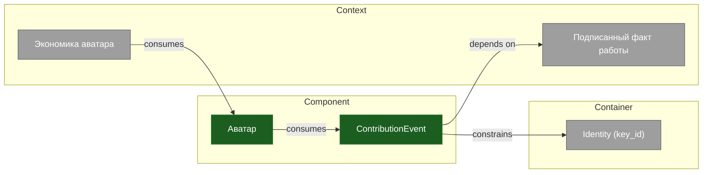

# Граф концепций: слой аватара

Канонические узлы экономики аватаров (RFP-034 §A.2). Источник правды по сущностям —
[Avatar Architecture Canon](../AVATAR-ARCHITECTURE-CANON.md); здесь они выражены как
адресуемые узлы концепт-графа, на которые ссылаются доки, спеки и код.

> **Покрытие:** 2/5 концептов под инвариантом (40%); grey (могут протухнуть): `cpt_avatar_economy`, `cpt_identity_key_id`, `cpt_signed_fact`
> **C4 (§3.7):** 2 Context, 1 Container, 2 Component

## Подписанный факт работы {#cpt_signed_fact}

Атом. Всё доказуемое сводится к цепочке подписанных фактов. Владелец — крипто-субстрат
(`trust_chain` / TrustChain Platform); аватар и экономика только ссылаются на него.

??? info "Детали — для разработчика"
    `cpt_signed_fact` · **grey** · C4: Context

    **Воплощён в:** `trust_chain`
    **Упоминается в:** [ContributionEvent](#cpt_contribution_event) ← depends_on

## ContributionEvent {#cpt_contribution_event}

Единственный мост «работа → аватар → экономика» (Канон §7). Одна версионированная схема,
импортируемая и apatch, и HC, — не «две схемы, совпадающие по соглашению». Денег не
содержит (экономический барьер); `avatar_id` == `key_id`; идемпотентна.

??? info "Детали — для разработчика"
    `cpt_contribution_event` · **guarded** · C4: Component

    **Воплощён в:** `avatar-contract/avatar_contract/contribution_event.py:ContributionEvent`, `apatch/contribution.py:build_event`
    **Связи:** depends_on → [Подписанный факт работы](#cpt_signed_fact), constrains → [Identity (key_id)](#cpt_identity_key_id)
    **Упоминается в:** [Аватар](#cpt_avatar) ← consumes
    **Утверждения:** `claim_one_contract`
    **Инварианты:** `SCHEMA-LOCKSTEP`, `economic_barrier`

## Аватар {#cpt_avatar}

Портативное, адресуемое по identity накопление подписанных фактов одного человека:
`Avatar = fold(ContributionEvents одного subject) → history + WorkEpisodes +
CapabilityEstimates + WorkAsset refs + asset_summary`. Без денег (инвариант под
тестом). Ownership создаёт портфель, не смешивая human/agent evidence. Проекция
вычисляется apatch Avatar Compiler.

??? info "Детали — для разработчика"
    `cpt_avatar` · **guarded** · C4: Component

    **Воплощён в:** `apatch/avatar_compiler.py`
    **Связи:** consumes → [ContributionEvent](#cpt_contribution_event)
    **Упоминается в:** [Экономика аватара](#cpt_avatar_economy) ← consumes
    **Инварианты:** `economic_barrier`

## Identity (key_id) {#cpt_identity_key_id}

Первичный ключ личности — `key_id` (sha256 публичного ключа сертификата). `github_login`,
`user_id`, `professional_uuid`, `contributor_id` — алиасы, резолвящиеся в `key_id`.

??? info "Детали — для разработчика"
    `cpt_identity_key_id` · **grey** · C4: Container

    **Воплощён в:** `apatch/contribution.py:resolve_identity`, `avatar-contract/avatar_contract/identity.py:AliasResolver`
    **Упоминается в:** [ContributionEvent](#cpt_contribution_event) ← constrains

## Экономика аватара {#cpt_avatar_economy}

Цена, клиринг, бонус, трансфер. Владелец — HC_Platform. Потребляет проекцию аватара
(не сырой реестр) и обязана учитывать `trust_level`: `claimed`-события в клиринг не входят.

??? info "Детали — для разработчика"
    `cpt_avatar_economy` · **grey** · C4: Context

    **Воплощён в:** `HC_Platform`
    **Связи:** consumes → [Аватар](#cpt_avatar)
